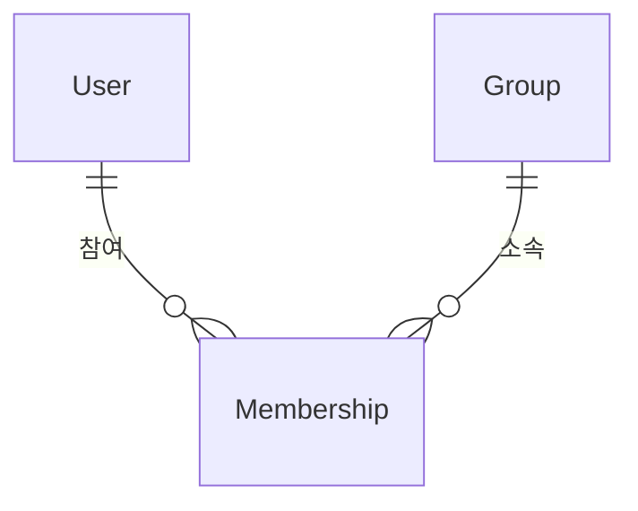

# md-to-pptx 트러블슈팅 가이드

generate_pptx.py 및 preview.py 사용 시 발생할 수 있는 문제와 해결 방법.

---

## 1. 이미지가 프리뷰/PPTX에 표시되지 않음

### 원인
slides.json의 이미지 경로가 **slides.json 파일 위치 기준**이 아닌 프로젝트 루트 기준으로 작성된 경우.
generate_pptx.py는 spec.json의 **디렉토리를 기준**으로 상대경로를 해석한다.

### 해결
slides.json이 `output/my-project/slides.json`에 있고, 이미지가 `output/my-project/_captures/`에 있다면:

```json
// ❌ 잘못된 경로 (프로젝트 루트 기준)
"image": "./output/my-project/_captures/screenshot.png"

// ✅ 올바른 경로 (slides.json 위치 기준)
"image": "./_captures/screenshot.png"
```

### 예방
캡처 이미지를 slides.json과 같은 디렉토리의 `_captures/` 하위에 저장하고, 경로는 항상 `./_captures/파일명.png` 형식으로 작성한다.

---

## 2. 프리뷰가 브라우저에 2번 열림

### 원인
preview.py의 서버 모드(`--serve`, 기본값)가 자동으로 `webbrowser.open()`을 호출하는데, 별도로 `start` 또는 `open` 명령으로 HTML을 한 번 더 여는 경우.

### 해결
- **서버 모드**로 실행하면 `start` / `open` 명령을 **사용하지 않는다** — 서버가 자동으로 브라우저를 연다.
- **비서버 모드**(`--no-serve`)로 실행하면 직접 `start` / `open`으로 HTML을 열어야 한다.

```bash
# 방법 1: 서버 모드 (자동 브라우저 오픈) — start 불필요
python preview.py slides.json preview.html --images-dir ./_captures &

# 방법 2: 비서버 모드 — 수동 오픈 필요
python preview.py slides.json preview.html --images-dir ./_captures --no-serve
start preview.html  # Windows
open preview.html   # macOS
```

---

## 3. 말머리 기호(•)와 텍스트 수직 정렬 불일치

### 원인 (이전 버전)
불릿 문자를 별도 텍스트 run (`"• "`)으로 추가하면 PowerPoint가 이를 본문 텍스트와 동일하게 배치하여, 불릿이 텍스트 베이스라인과 맞지 않는 현상이 발생했다.

### 해결 (현재 버전)
PowerPoint 네이티브 불릿 기능(`a:buChar`, `a:buAutoNum`)을 사용하도록 변경하여 자동 정렬됨.
- `bullet_list` → `a:buChar` (char="•") + `a:buClr` (테마 accent 색상)
- `numbered_list` → `a:buAutoNum` (type="arabicPeriod") + `a:buClr`

---

## 4. ERD/다이어그램을 코드블록이 아닌 이미지로 표시하기

### 방법
mermaid CLI로 다이어그램 이미지를 생성하고, slides.json에서 `image-full` 또는 `content-image` 레이아웃으로 삽입한다.

```bash
# mermaid CLI로 이미지 생성
npx -y @mermaid-js/mermaid-cli -i diagram.mmd -o diagram.png -w 1920 -H 1080 --backgroundColor transparent
```



slides.json 예시:
```json
{
  "layout": "image-full",
  "title": "ERD 주요 엔티티",
  "image": "./_captures/erd.png",
  "caption": "데이터베이스 엔티티 관계도"
}
```

### 지원 다이어그램
mermaid가 지원하는 모든 다이어그램 유형 사용 가능: `erDiagram`, `flowchart`, `sequenceDiagram`, `classDiagram`, `gantt`, `pie` 등.

---

## 5. YouTube 영상이 PPTX에서 재생되지 않음

### 원인 (이전 버전)
YouTube URL을 스크린샷으로 캡처하고 하이퍼링크만 추가하여, 클릭 시 외부 브라우저로 이동했다.

### 해결 (현재 버전)
`_embed_online_video()` 헬퍼가 PowerPoint의 온라인 비디오 프레임을 oxml로 삽입한다.
- 썸네일 이미지를 포스터 프레임으로 사용
- `a:videoFile` + `p14:media` 요소로 PowerPoint 2013+에서 인라인 재생 가능
- 재생 버튼(▶) 오버레이 + 폴백 하이퍼링크도 유지

### 주의
- **PowerPoint 2013 이상** 필요 (온라인 비디오 기능)
- **인터넷 연결** 필요 (YouTube 스트리밍)
- LibreOffice/Google Slides에서는 하이퍼링크 폴백만 동작

---

## 6. 코드블록이 슬라이드 밖으로 넘침

### 원인 (이전 버전)
코드블록 배경 높이는 최대 12줄로 제한되지만 텍스트는 전체를 렌더링하여, 긴 코드가 배경 밖으로 overflow.

### 해결 (현재 버전)
12줄 초과 시 코드를 truncate하고 `...`을 표시한다. 배경 높이와 텍스트가 일치함.

---

## 7. 테이블 헤더에 불필요한 border 선이 보임

### 원인 (이전 버전)
`layout_table`의 헤더 셀에서 bottom border만 설정하고 left/right/top은 python-pptx 기본값이 남아있었음.

### 해결 (현재 버전)
4면 모두 명시적으로 border를 제거/설정하여 `_render_inline_table`과 일관된 스타일 적용.

---

## 8. 취소선(~~)이 렌더링되지 않음

### 원인 (이전 버전)
마크다운 파서가 `~~text~~`를 인식하지만 python-pptx에 네이티브 strikethrough API가 없어 스타일 미적용.

### 해결 (현재 버전)
oxml 직접 조작으로 구현: `run._r.get_or_add_rPr().set('strike', 'sngStrike')`

---

## 9. 오버플로우 분할이 영문 콘텐츠에서 너무 공격적임

### 원인 (이전 버전)
chars_per_line을 한글 기준(인치당 5자)으로만 계산하여, 영문(인치당 ~9자) 텍스트의 높이를 과대 추정.

### 해결 (현재 버전)
`_estimate_chars_per_inch()` 함수가 CJK 문자 비율을 분석하여 한글(5자/인치)과 영문(9자/인치)의 가중 평균으로 계산한다.

---

## 10. KPI 슬라이드 타이틀에 폰트 스타일이 적용되지 않음

### 원인 (이전 버전)
`layout_kpi`에서 타이틀을 `.text = ` 직접 할당하여 폰트 크기/색상/Bold/EA 폰트가 누락.

### 해결 (현재 버전)
다른 레이아웃과 동일하게 `_render_slide_title()` 헬퍼를 사용하여 일관된 타이틀 스타일 적용.
